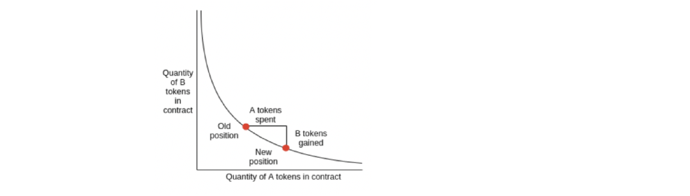
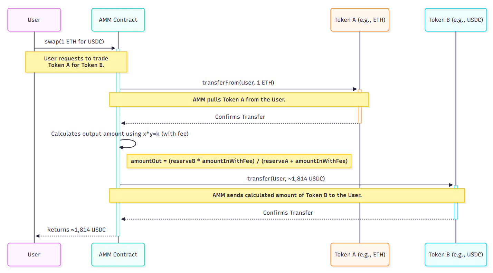
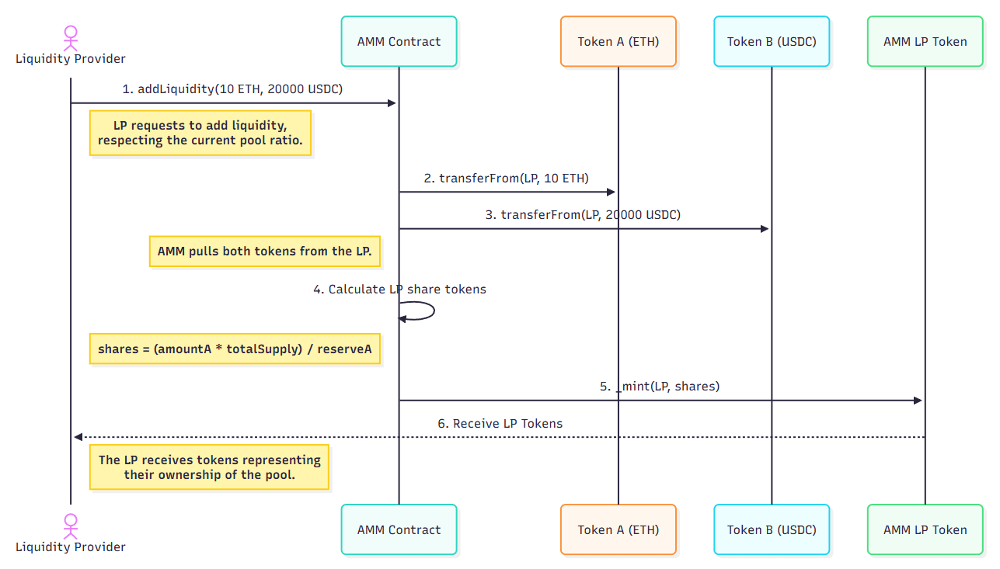
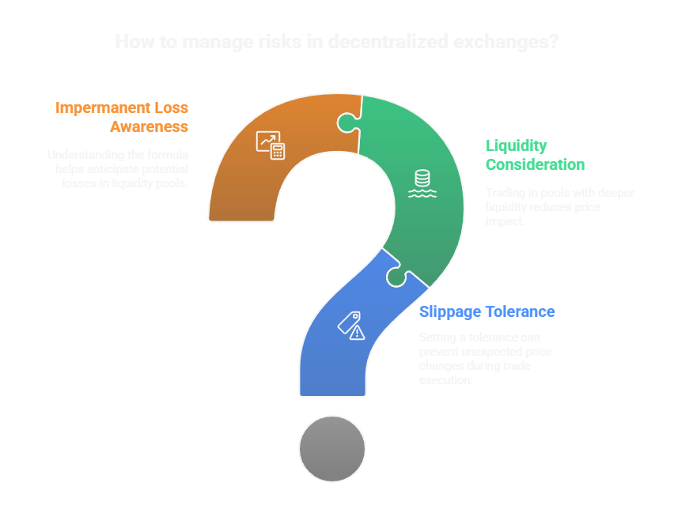

### AMMs
* AMMs使用数学公式，而不是订单簿，来设定价格并实现全天候链上交易
* 常数乘积公式 `(x * y = k)` 驱动着Uniswap和大多数DEX(确保流动性但会导致价格影响和永久性损失)
* 流动性提供者 (LPs) 将最多两种代币 (例如ETH和USDC) 存入一个池中，用户可以在两者之间进行交易，
而LPs则通过收取费用获取收益，但如果单币价格出现偏离，LPs会面临永久性损失的风险
* 关键风险: 价格影响、滑点、永久损失和套利
* 最佳实践: 理解数学原理，使用安全代码，并始终将流动性提供者费用与潜在损失进行比较

#### AMMs历史动机
> 传统交易所使用中心限价订单簿（CLOB）来匹配买家和卖家。这种方法在流动性良好的市场中效果很好，
但对于流动性差的资产则不适用，并且在链上操作由于高延迟和气体成本而难以实现。
自动做市商（AMM）被发明出来以解决这些问题（通过数学和流动性池来实现无需订单簿或做市商的无许可、全天候交易，适用于任何代币对）。

#### AMM
自动做市商 (AMMs) 是去中心化交易所 (DEX) 如Uniswap、SushiSwap和Balancer的核心。
与使用订单簿匹配买卖双方的传统交易所不同，AMMs 使用智能合约和数学公式来定价并创建代币池。
任何人都可以在任何时间无权限地进行交易或提供流动性。

###### AMMs工作机制
* 用户与代币池 (流动性池) 进行交易，而不是与其他交易者直接交易
* 价格由数学公式决定，而不是通过匹配订单
###### AMMs重要性
* 自动做市商使去中心化金融交易变得无需许可、全天候进行，并且对任何拥有钱包的人都开放。

> 自动做市商的核心：流动性池、无需许可的交易和链上定价

#### 常数乘积公式 (x * y = k) 详解
最流行的自动做市商 (AMM) 模型是恒定乘积做市商 (CPMM)，Uniswap v2和其他许多平台都使用了这种模型。

公式: `x * y = k`
* x = X代币的储备量（例如ETH）
* y = Y代币的储备量（例如USDC）
* k = 常数（储备的乘积，在交换过程中不得减少）

* 当你用一种代币交换另一种代币时，会改变储备，但乘积（k）保持不变。
* 购买的代币越多，价格就越贵（滑点/价格影响）。
###### 关键属性
* 保证流动性: 可以随时交易，但大额交易的价格会变差
* 无需订单簿: 所有定价都在链上并且是自动的

#### AMM曲线
方程 x * y = k 描述了第一象限内的双曲线。池中的每一种可能状态都对应曲线上的一点。


* 每次交易都会沿着常数乘积曲线移动池的储备余额，改变代币比例，从而影响价格
* 即时价格：某点切线的斜率(y/x)（初始状态下，这是 $y_0 /x_0$ ）
* 执行价格: 有限交易的平均价格 (起始点与结束点之前的割线)

**关键洞察: 曲线确保在储备金接近零时价格不会变得极端，从而防止抽空池子**

#### 价格影响、滑点和非永久性损失
##### 滑点（用户风险）
* 定义: 提交交易时显示的预期价格与实际执行时的价格之间的差异
* 原因:
  * 价格影响
  * 其他待处理交易（在您之前提交但先被矿工处理）
  * 网络延迟、矿工可提取价值 (MEV) 或机器人抢先交易
* 缓解措施: 大多数去中心化交易所 (DEX) 允许设置滑点容忍度。如果最终价格超过这个阈值，交易将被撤销。
##### 价格影响（滑点的一个组成部分）
* 定义: 由于AMM曲线导致的直接价格变动，由你自己的交易引起
* 原因: 在像 Uniswap 这样的自动做市商（AMM）中，代币价格由一条曲线（x * y = k）决定。大额交易会沿着曲线更远地移动，从而恶化价格
* Tips: 更深的流动性 = 更少的价格影响

##### 浮动损失（流动性提供者风险）
* 定义: 如果价格出现分歧，流动性提供者所经历的损失，与仅仅持有这两种代币相比
* 原因: 当外部价格变动时，套利者会重新平衡池子，导致流动性提供者持有更多的亏损资产
* 50/50 池子公式: `IL = 2 * sqrt(price_ratio) / (1 + price_ratio) - 1`
* 举例: 如果 ETH 相对于 USDC 的价格翻倍，流动性提供者相比持有代币（HODL）会损失约 5.7%。

#### Swap 数学推导公式
当你在自动化做市商（AMM）中交换代币时，输出数量由考虑费用的常数乘积公式决定
###### 逐步换算数学
假设使用 tokenX的 $\Delta x$ 交换 token Y:
* 初始储备: $x_0 * y_0 = k$
* 交换后: $(x_0 + \Delta x) \cdot (y_0 - \Delta y) = k$
* 求输出数量 $\Delta y$ : $\Delta y = y_0 - \frac{k}{x_0 + \Delta x}$

###### 含手续费(例如0.3%)
* 仅使用了 Δx 的一部分进行交换： $\Delta x_{\text{exec}} = \Delta x \cdot 0.997$
* 输出公式为: `amountOut = (reserveOut * amountInWithFee) / (reserveIn + amountInWithFee)`

其中 `amountInWithFee = amountIn * 0.997` （对于 0.3% 的费用）

###### 现货价格 vs. 执行价格
* 即时价格：某点切线的斜率(y/x)（初始状态下，这是 $y_0 /x_0$ ）。
* 执行价格：有限交易的平均价格（起始点与结束点之间的割线）。
* 价格影响：成交价格与即时价格之间的差额会随着交易规模的增大而增加。
##### 例子
假设池中有10个ETH和20,000个USDC (reserveIn = 10, reserveOut = 20,000)。
你想用1个ETH兑换USDC。
1. 计算`amountInWithFee = 1 * 0.997 = 0.997`
2. 代入公式:
`amountOut = (20,000 * 0.997) / (10 + 0.997) ≈ 1,814.6 USDC`
3. 兑换后，储备金会更新，价格会根据曲线进行调整

> 这个公式确保了储备金的乘积几乎保持不变，扣除费用后，这是像 Uniswap 这样的自动做市商（AMM）运作的核心。

AMM中的核心交易过程，从输入到输出计算。

#### 流动性提供者(LP)代币与流动性数学
###### 提供流动性
* 首次流动性提供者: 设置初始价格。获得流动性提供者代币 = `sqrt(amount0 * amount1)`
* 后学流动性提供者: 必须按照当前池子的比例存入代币。获得的流动性提供者代币与其份额成正比
###### 移除流动性
* 燃烧流动性提供者代币以提取相应份额的储备金

##### LP代币数学重要性
* 防止捐赠攻击 (一种将代币直接发送到池合约的技术，可能会扰乱其内部会计和定义)
* 确保所有流动性提供者公平分享池中的份额

向自动化做市商（AMM）提供流动性并获得LP代币作为回报

#### Solidity 代码解析：交换、添加和移除流动性
```solidity
// SPDX-License-Identifier: MIT
pragma solidity ^0.8.20;

// 引入 OpenZeppelin 提供的 ERC20 接口和实现
import "@openzeppelin/contracts/token/ERC20/IERC20.sol";
import "@openzeppelin/contracts/token/ERC20/ERC20.sol";

/// @title MinimalAMM
/// @notice 一个最小化的恒定乘积 AMM (x * y = k)，支持 swap、添加/移除流动性
contract MinimalAMM is ERC20 {
    // 两个池子代币
    IERC20 public immutable token0;
    IERC20 public immutable token1;

    // 当前池子储备量
    uint public reserve0;
    uint public reserve1;

    /// @notice 构造函数，初始化 token0 和 token1
    /// @param _token0 第一个代币地址
    /// @param _token1 第二个代币地址
    constructor(address _token0, address _token1) ERC20("AMM LP", "AMMLP") {
        token0 = IERC20(_token0);
        token1 = IERC20(_token1);
    }

    /// @notice 交易函数：输入 tokenIn，输出另一种 token
    /// @param amountIn 用户输入的代币数量
    /// @param tokenIn 输入代币的合约地址（必须是 token0 或 token1）
    /// @param amountOutMin 用户期望的最小输出数量（防滑点保护）
    /// @return amountOut 实际收到的输出代币数量
    function swap(uint amountIn, address tokenIn, uint amountOutMin) external returns (uint amountOut) {
        require(amountIn > 0, "Zero input"); // 输入数量必须大于 0
        require(tokenIn == address(token0) || tokenIn == address(token1), "Invalid token"); // 必须是池子支持的代币

        // 确定输入/输出代币和对应储备
        (IERC20 input, IERC20 output, uint reserveIn, uint reserveOut) =
            tokenIn == address(token0) ? (token0, token1, reserve0, reserve1) : (token1, token0, reserve1, reserve0);

        // 用户转入 amountIn 个代币到 AMM 合约
        input.transferFrom(msg.sender, address(this), amountIn);

        // 收取 0.3% 手续费，997/1000 = 0.997
        uint amountInWithFee = amountIn * 997 / 1000;

        // 恒定乘积公式：Δy = (reserveOut * Δx_eff) / (reserveIn + Δx_eff)
        amountOut = (reserveOut * amountInWithFee) / (reserveIn + amountInWithFee);

        // 防滑点保护：必须大于等于用户设置的最小值
        require(amountOut >= amountOutMin, "Slippage");

        // 转账输出代币给用户
        output.transfer(msg.sender, amountOut);

        // 更新储备量
        reserve0 = token0.balanceOf(address(this));
        reserve1 = token1.balanceOf(address(this));
    }

    /// @notice 添加流动性，用户存入 token0 和 token1，获得 LP token
    /// @param amount0Desired 希望存入的 token0 数量
    /// @param amount1Desired 希望存入的 token1 数量
    /// @return shares 铸造的 LP token 数量
    function addLiquidity(uint amount0Desired, uint amount1Desired) external returns (uint shares) {
        uint amount0;
        uint amount1;

        if (reserve0 == 0 && reserve1 == 0) {
            // 初始情况：没有储备，用户存入的即为流动性
            amount0 = amount0Desired;
            amount1 = amount1Desired;
        } else {
            // 确保添加流动性时保持当前价格比例 (amount0 / amount1 ≈ reserve0 / reserve1)
            uint amount1Optimal = (amount0Desired * reserve1) / reserve0;
            if (amount1Optimal <= amount1Desired) {
                // 用户提供的 token1 足够，只用 amount0Desired 和计算得到的 amount1Optimal
                amount0 = amount0Desired;
                amount1 = amount1Optimal;
            } else {
                // 否则，按 token1 的数量决定 token0 的最优数量
                uint amount0Optimal = (amount1Desired * reserve0) / reserve1;
                amount0 = amount0Optimal;
                amount1 = amount1Desired;
            }
        }

        // 把代币转入合约
        token0.transferFrom(msg.sender, address(this), amount0);
        token1.transferFrom(msg.sender, address(this), amount1);

        // 计算铸造的 LP 份额
        if (totalSupply() == 0) {
            // 初始情况下：shares = sqrt(amount0 * amount1)
            shares = sqrt(amount0 * amount1);
        } else {
            // 后续情况：按比例计算 shares，这里用 token0 作为基准
            shares = (amount0 * totalSupply()) / reserve0;
        }

        require(shares > 0, "Insufficient shares");

        // 给用户铸造 LP token
        _mint(msg.sender, shares);

        // 更新储备量
        reserve0 = token0.balanceOf(address(this));
        reserve1 = token1.balanceOf(address(this));
    }

    /// @notice 移除流动性，销毁 LP token，取回相应比例的 token0 和 token1
    /// @param shares 用户希望销毁的 LP token 数量
    /// @return amount0 取回的 token0 数量
    /// @return amount1 取回的 token1 数量
    function removeLiquidity(uint shares) external returns (uint amount0, uint amount1) {
        require(shares > 0, "Zero shares");

        // 按比例计算用户能取回的代币
        amount0 = (reserve0 * shares) / totalSupply();
        amount1 = (reserve1 * shares) / totalSupply();

        require(amount0 > 0 && amount1 > 0, "Insufficient liquidity");

        // 销毁用户的 LP token
        _burn(msg.sender, shares);

        // 更新储备
        reserve0 = token0.balanceOf(address(this));
        reserve1 = token1.balanceOf(address(this));

        // 把 token0 和 token1 转给用户
        token0.transfer(msg.sender, amount0);
        token1.transfer(msg.sender, amount1);
    }

    /// @notice 内部 sqrt 函数，用牛顿迭代法近似计算平方根
    /// @param y 输入值
    /// @return z 平方根结果
    function sqrt(uint y) internal pure returns (uint z) {
        if (y > 3) {
            z = y;
            uint x = y / 2 + 1;
            while (x < z) {
                z = x;
                x = (y / x + x) / 2;
            }
        } else if (y != 0) {
            z = 1;
        }
    }
}
```
* 安全提示: 始终遵循 Checks-Effects-Interactions 模式，并在生产环境中使用 OpenZeppelin 的库

##### 安全模式与最佳实践
* 检查-效果-交互（CEI）：在外部调用前更新状态，以防止重入攻击
* 重入攻击: AMM（自动做市商）相对较少受到影响，但在复杂逻辑中仍应使用 CEI，并考虑使用 OpenZeppelin 的 ReentrancyGuard 
* 数学精度: 使用整数运算，避免溢出，并使用经过验证的数学库（参见 Uniswap 的 Math.sol ）
* Fee-on-transfer tokens: 生产 AMM 处理这些边缘情况（测试非标准 ERC20）

#### AMM模型比较
| 模型            | 公式        | 曲线    | 用例         | 权衡 |
|---------------|-----------|-------|------------|----|
| CPMM          | x * y = k | 双曲线   | 通用代币互换     |大额交易滑点高
| Constant Sum  | x + y = k | 线性    | 稳定币互换      |如果价格偏离1:1,无流动性 
| Constant Mean | $\prod_i x_i^{w_i} = k$       | 多维    | 多资产池       | 复杂数学，灵活权重 
| Hybrid        | 组合        | 平坦/曲线 | 稳定币(Curve) |低滑点，脱钩时恢复为CPMM

模型使用场景:
* CPMM (x*y=k)：适用于一般的代币交换，尤其是当你希望任何一对代币都能保证流动性时。缺点：对于大额交易，滑点较高。
* Constant Sum (x+y=k)：适用于稳定币到稳定币的交换，当你希望在接近 1:1 时无滑点时，这是理想的选择。但请注意：如果价格变动，任何一方都可能被抽空。
* Constant Mean: Balancer 使用于多资产池且具有自定义权重（例如 80/20）。适用于组合管理，但数学和流动性损失更为复杂。
* Hybrid (Curve/StableSwap): 结合了连续性价格加权模式（CPMM）和常数和模式，适用于紧密相关资产之间的低滑点互换（例如稳定币）。如果价格脱钩，则会退回到 CPMM。

#### 高级风险: Oracles, Front-Running, Sandwich Attacks
* 预言机操控：永远不要使用即时价格作为预言机数据。使用 TWAP（时间加权平均价格）或 Chainlink。
* Front-running & Sandwich Attacks: 机器人可以在内存池中看到你的交易，并在你之前或之后进行交易。使用紧滑点和私有中继（Flashbots）以降低风险。


去中心化交易所的风险管理: 滑点、非永久性损失和流动性深度
#### 集中流动性与AMMs的演变
* Uniswap v3 引入了集中流动性，允许流动性提供者（LP）在选定的价格范围内分配资金。这提高了资金效率和费用潜力，但也带来了权衡:
  * LP 必须积极管理仓位以保持在范围内
  * 当价格超出范围时，流动性会变得单边 (完全集中在一种资产上),不再赚取费用,并且与 v2 相比增加了永久性损失的风险。
* Stablecoin AMMs（Curve, Balancer）：使用不同的算法进行低滑点交换，适用于相似资产之间的交易
* 资本效率：CPMMs 简单但效率低下；新模型使流动性提供者能够将资本集中在最需要的地方

#### 经济学与博弈论见解
* 套利：对于保持 AMM 的价格与全球价格同步至关重要，但会导致流动性提供者（LP）遭受非永久性损失。套利者从 AMM 购买被低估的资产，然后在开放市场出售，从而将 AMM 价格拉回合理水平。这一过程正是导致流动性提供者遭受非永久性损失的原因
* 套利者损失 vs. 重新平衡（LVR）：套利者提取的价值是流动性提供者的损失 vs. 持币不动。这是一个基本的权衡：流动性提供者通过收取费用获利，但作为“做空波动性”的一方，如果价格大幅偏离，他们就会亏损。
* 流动性提供者做空波动性：他们通过收取费用获利，但如果价格大幅变动，他们就会亏损。提供流动性就像出售期权：在稳定市场中获利，但如果价格急剧变动，就会亏损。

#### 开发者与流动性提供者的实用建议

* 理解数学原理：在提供流动性之前，了解价格影响和永久性损失是如何工作的

* 使用经过审核的代码：始终使用 OpenZeppelin 和经过验证的 AMM 模板

* 监控你的仓位：跟踪赚取的费用与潜在的流动性损失

* 使用非标准代币测试：一些 ERC20 代币带有转账费用或非标准逻辑

* 保持更新：DeFi 发展迅速，关注新的 AMM 模型和安全最佳实践

#### AMM力量与权衡
AMM 通过使链上交易和流动性提供变得简单且无需许可，革新了 DeFi。但其背后的数学模型也带来了新的风险（价格影响、永久性损失和套利）。通过理解常数乘积公式并使用安全且经过充分审核的代码，您可以在去中心化金融的世界中自信地交易和构建